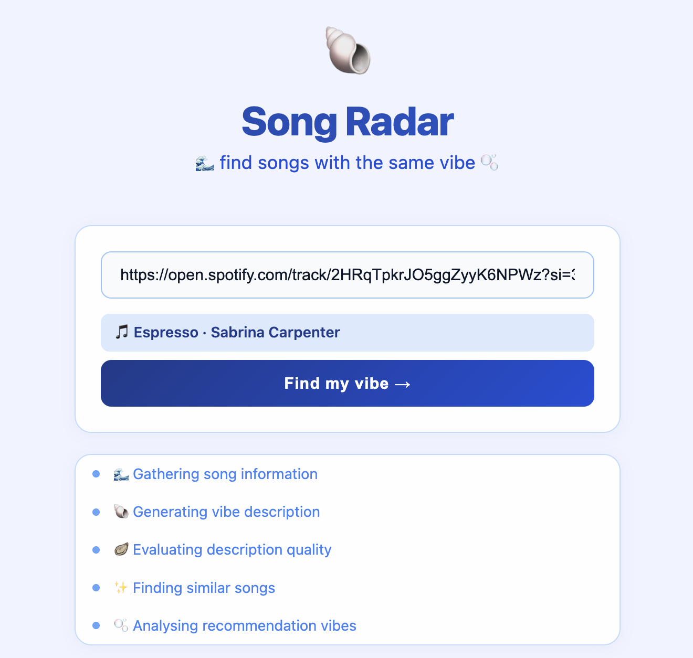
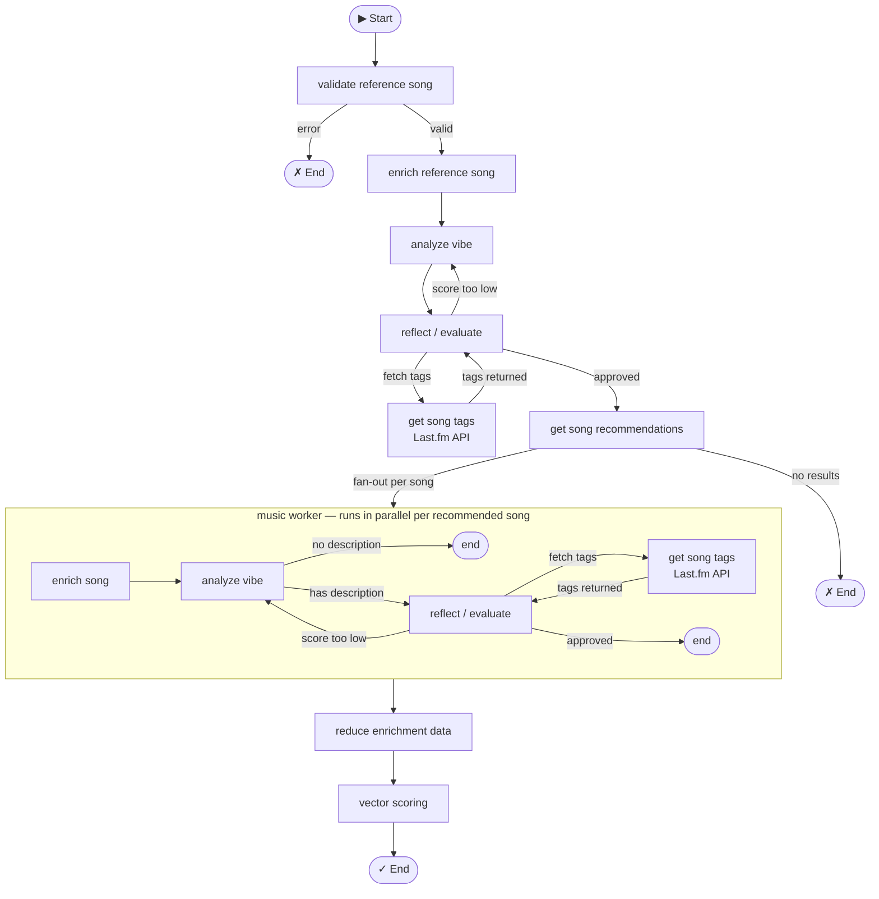

# Song Vibe Radar: Agentic Vector-Based Music Recommendation System

An agentic music discovery system that prioritizes the "vibes" of songs. 

Have you ever gotten frustrated over irrelevant song recommendations on streaming platforms? This project lets you find songs based on "vibe" similarity - is the vibe like..
* Crying while dancing in the club?
* Neon-lights nighttime drive EDM?
* Nostalgic city-pop bicycle ride?
* Quiet acoustic morning reflection?

Discover new music that matches the vibe of your favorite tracks!

## Demo / User Interface

Search interface + agent progress:



Results:


## Features

- **Vibe-Based Discovery**: Focuses on emotional and atmospheric qualities rather than just genre or popularity.
- **Aesthetic Profile Generation**: Generates a unique "vibe description" for each song.
- **Real-Time Evaluation**: Uses LLM-as-a-judge for quality assessment of vibe descriptions by scoring them.
- **Vector Embeddings**: Employs semantic similarity for accurate vibe matching.
- **Agentic Architecture**: Built with LangGraph for robust, stateful processing.

## Installation

1. Clone the repository:
   ```bash
   git clone https://github.com/madibary/song_vibe_radar.git
   cd song_vibe_radar
   ```

2. Create a virtual environment:
   ```bash
   python -m venv venv
   source venv/bin/activate  # On Windows: venv\Scripts\activate
   ```

3. Install dependencies:
   ```bash
   pip install -r requirements.txt
   ```

4. Set up environment variables: copy `.env.example` to `.env` and fill in your keys — the file lists everything required.

## Usage

### Web app (recommended)

```bash
uvicorn web_app:app --reload
```

Open `http://localhost:8000` in your browser, enter a track name and artist, and the app will stream live progress as it finds recommendations.

### CLI

```bash
python app.py
```

Enter the reference track name and artist when prompted. The system will process and output recommendations.

## How It Works

The system uses a graph-based architecture, containing internal agentic feedback loops based on evaluations and scoring, and a fan-out mechanism for concurrent song recommendations processing.

An external music API is used to gather potential song recommendations.
Each song, including the input reference song, gets a unique "vibe description" generated by an LLM, based on song reviews and lyrics obtained in the enrichment process.
A separate LLM then evaluates the description. if rejected, the feedback is appended to the message history and routed back to the 'vibe generator' for revision.

In the final stage, the vibe descriptions are converted into vector embeddings and ranked by cosine similarity. The results are then displayed in descending order, delivering a truly vibe-centric, energy-first recommendation engine.




## Evaluation Strategy

As the vibe description generated for each song is a subjective, textual aesthetic profile, the main chosen evaluation strategy is LLM-as-a-judge.
The judge LLM scores the description from 1 to 10 based on the criteria specified in its system prompt.
It primarily evaluates accuracy and specificity: the aesthetic description must align with the song data without hallucinating details. Furthermore, it prevents generic descriptions to ensure the generated energy profile is unique enough to provide a meaningful basis for the later vector-based scoring.
It then suggests improvements in its feedback.
Furthermore, the evaluation LLM uses the "get song tags" tool to verify the accuracy of the description.

Evaluations are returned as structured data containing a score and textual feedback. If the score is below the preferred threshold, the description enters a refinement loop. The workflow state maintains an iteration counter to manage token consumption. The loop exits once the evaluation passes or the iteration threshold is exceeded.


## Tech Stack

- **[LangGraph](https://github.com/langchain-ai/langgraph)** — agentic graph orchestration
- **[LangChain](https://github.com/langchain-ai/langchain)** — LLM abstractions and message handling
- **[OpenAI](https://platform.openai.com/)** — vibe description generation, LLM-as-a-judge evaluation, and vector embeddings
- **[Spotify API](https://developer.spotify.com/)** — track lookup and resolution
- **[Last.fm API](https://www.last.fm/api)** — song recommendations and tag validation
- **[Tavily](https://tavily.com/)** — web search for song reviews
- **[Starlette](https://www.starlette.io/) + [uvicorn](https://www.uvicorn.org/)** — web server with SSE streaming
- **[LangSmith](https://smith.langchain.com/)** — tracing and observability

## Project Structure

- `app.py`: CLI entry point.
- `web_app.py`: Web app entry point (Starlette + uvicorn).
- `graphs/`: Contains the main graph and subgraphs.
- `nodes/`: Individual processing nodes.
- `models/`: AI models for description generation and evaluation.
- `state/`: State definitions.
- `helpers/`: Utility tools.
- `tools/`: Tools for LLM use.

## Contributing

Contributions are welcome! Please open an issue or submit a pull request.

## License

This project is licensed under the MIT License.
