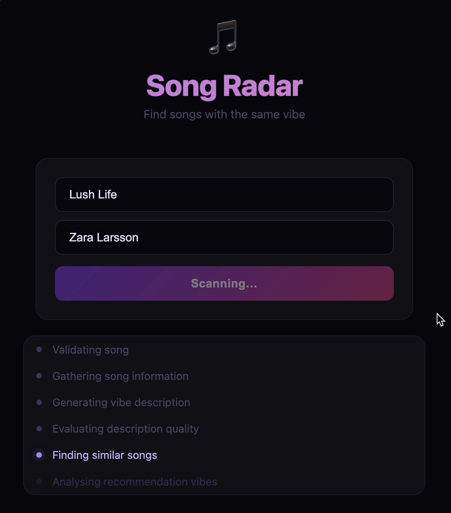
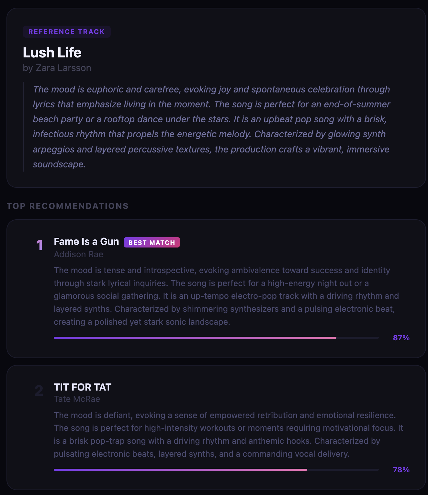
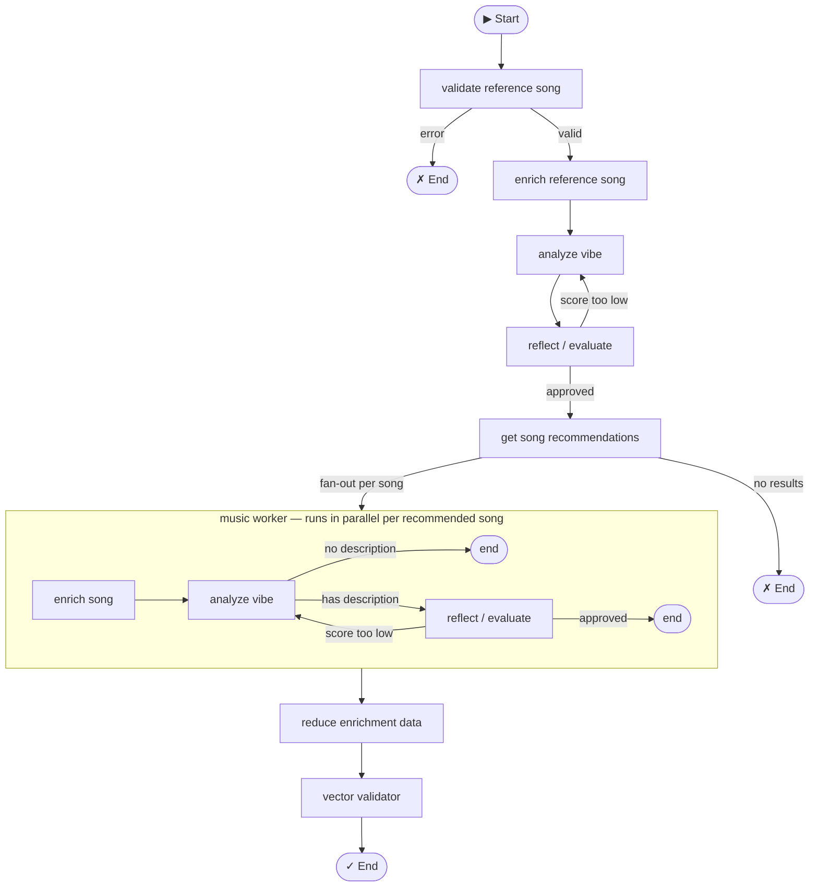

# Song Vibe Radar

An agentic music discovery system that prioritizes the "vibes" of songs. 

Have you ever gotten frustrated over irrelevant song recommendations on streaming platforms? This project lets you find songs based on "vibe" similarity - is the vibe like..
* Crying while dancing in the club?
* Neon-lights nighttime drive EDM?
* Nostalgic city-pop bicycle ride?
* Quiet acoustic morning reflection?

Discover new music that matches the vibe of your favorite tracks!

## Description

This project allows users to input a reference song (by name and artist), and the system will:

1. Generate a detailed vibe description for the reference song.
2. Evaluate the description quality using an LLM-as-a-judge.
3. Find song recommendations.
4. Generate and evaluate vibe descriptions for each recommendation.
5. Sort recommendations based on vibe similarity using vector embeddings.
6. Output a sorted list of top songs that match the reference song's vibe.

## Demo / User Interface

Search interface + agent progress:



Results sample:



## Features

- **Vibe-Based Discovery**: Focuses on emotional and atmospheric qualities rather than just genre or popularity.
- **Real-Time Evaluation**: Uses LLM-as-a-judge for quality assessment of vibe descriptions by scoring them.
- **Vector Embeddings**: Employs semantic similarity for accurate vibe matching.
- **Agentic Architecture**: Built with LangGraph for robust, stateful processing.

## Installation

1. Clone the repository:
   ```bash
   git clone https://github.com/madibary/song_vibe_radar.git
   cd song_vibe_radar
   ```

2. Create a virtual environment:
   ```bash
   python -m venv venv
   source venv/bin/activate  # On Windows: venv\Scripts\activate
   ```

3. Install dependencies:
   ```bash
   pip install -r requirements.txt
   ```

4. Set up environment variables (create a `.env` file):
   - `GROQ_API_KEY`: API key for Groq (used for vibe description generation).
   - `OPENROUTER_API_KEY`: API key for OpenRouter (used for evaluation).
   - `LAST_FM_API_KEY`: API key for Last.fm (used for song recommendations and validation).
   - `TAVILY_API_KEY`: API key for Tavily (used for web search).
   - `GENIUS_API_KEY`: API key for Genius (used for lyrics and song data).
   - `LOG_LEVEL` (optional): Logging level, defaults to "INFO".
   - `LOG_FILE` (optional): Log file path, defaults to "song_radar.log".

## Usage

### Web app (recommended)

```bash
uvicorn web_app:app --reload
```

Open `http://localhost:8000` in your browser, enter a track name and artist, and the app will stream live progress as it finds recommendations.

### CLI

```bash
python app.py
```

Enter the reference track name and artist when prompted. The system will process and output recommendations.

## How It Works

The system uses a graph-based architecture with the following components:

- **Nodes**: Handle specific tasks like song processing, vibe analysis, evaluation, and recommendations.
- **State Management**: Maintains context across processing steps.
- **Vector Based Ranking**: Ensures vibe descriptions are semantically aligned and ranks them by semantic similarity.



## Tech Stack

- **[LangGraph](https://github.com/langchain-ai/langgraph)** — agentic graph orchestration
- **[LangChain](https://github.com/langchain-ai/langchain)** — LLM abstractions and message handling
- **[Groq](https://groq.com/)** — fast LLM inference for vibe description generation (Qwen3-32B)
- **[OpenRouter](https://openrouter.ai/)** — LLM-as-a-judge evaluation (GPT-4o)
- **[sentence-transformers](https://www.sbert.net/)** — vector embeddings for vibe similarity ranking
- **[Last.fm API](https://www.last.fm/api)** — song validation and recommendations
- **[Genius API](https://docs.genius.com/)** — lyrics retrieval
- **[Tavily](https://tavily.com/)** — web search for song reviews
- **[Starlette](https://www.starlette.io/) + [uvicorn](https://www.uvicorn.org/)** — web server with SSE streaming
- **[LangSmith](https://smith.langchain.com/)** — tracing and observability

## Project Structure

- `app.py`: CLI entry point.
- `web_app.py`: Web app entry point (Starlette + uvicorn).
- `graphs/`: Contains the main graph and subgraphs.
- `nodes/`: Individual processing nodes.
- `models/`: AI models for description generation and evaluation.
- `state/`: State definitions.
- `helpers/`: Utility tools.

## Contributing

Contributions are welcome! Please open an issue or submit a pull request.

## License

This project is licensed under the MIT License.
